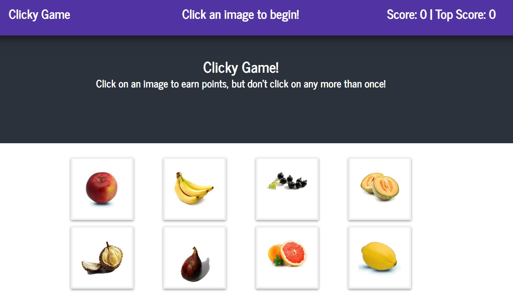

# Clicky-Game

## Overview

This is a memory game using the MERN stack. The application's UI is split into five components.

* Nav-Bar
* Header
* Main
* Cards in Main
* Footer

## How It Works

1. The app renders 12 different images of fruit to the screen. Each image listens for click events.

2. The app then keeps track of the user's score. The user's score is incremented when clicking an a fruit for the first time. The user's score is reset to 0 if they click the same fruit more than once.

4. Every time an image is clicked, the images rendered to the page shuffle themselves in a random order.

5. Once the user's score is reset after an incorrect guess, the game restarts while keeping the highscore. highscore is reset after page refresh. 

## Technologies used

* MongoDB
* Express
* React
* Node.js
* ES6
* CSS

## Website

https://memory-game1.herokuapp.com/

## Copyright

Kai Richardson © 2019.  All rights reserved.